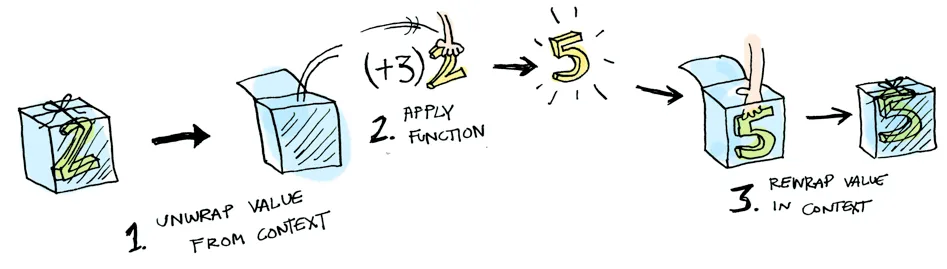
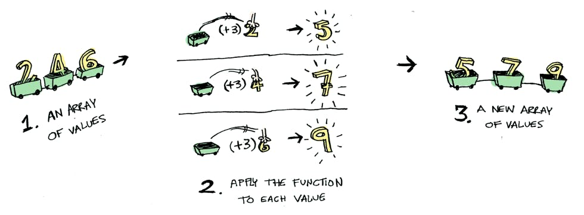
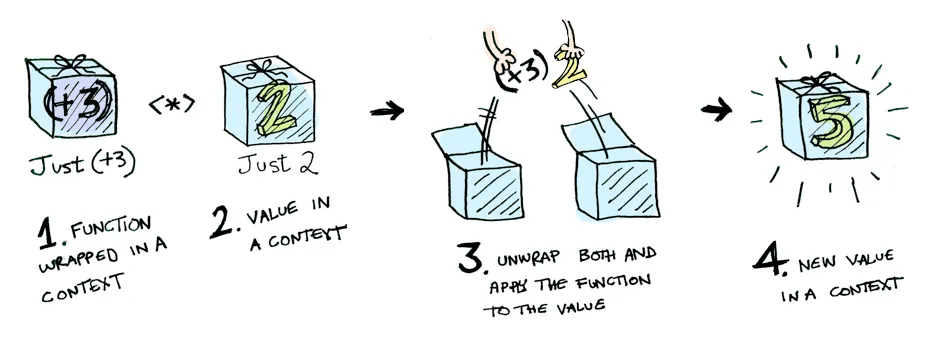
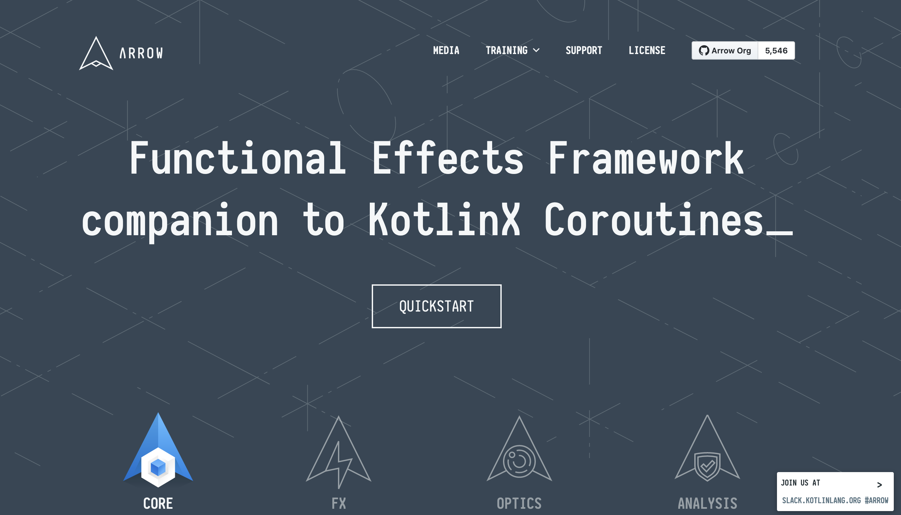

## Unlocking the Power of Functional Programming in Kotlin
---
## 
```sh [1|2-3|4|6-7]
$> whoami
- Giovanni Laquidara
- Developer Advocate for Amazon Appstore Game and Services
>>>> Not a marketer.

- 15+ years as a C++/Java Software Engineer
- 6+ as Android Developer
```
---
### Unlocking the Power of Functional Programming in Kotlin

#### Styles of Programming
- Imperative:  What to do and how!
- Declarative: What to do!
- Functional?

Note:
- Imperative programming is a programming paradigm that focuses on describing how a program should accomplish a task, step by step. In imperative programming, the state of the program changes over time as it executes.
- Declarative programming is a programming paradigm that emphasizes expressing the logic of a program without describing the control flow. In declarative programming, the programmer specifies what the program should do, rather than how to do it.
- 
---
### Functional programming
Declarative + high order function

**High order function**
Take a function as a parameter, return a function, create function inside

```kotlin

fun performOperation(x: Int, operation: (Int) -> Int): Int {
    return operation(x)
}

fun square(x: Int): Int {
    return x * x
}
val result = performOperation(5, ::square)
```
> Functional composition power!!!

Note:
- Declarative programming emphasizes the manipulation of data and expressing relationships between data elements, while functional programming emphasizes the use of functions and defining the flow of control.
- Functional programming is a programming paradigm that emphasizes the use of pure functions and immutable data to solve problems. In functional programming, functions are treated as first-class citizens and can be passed around like any other data type.
---
### Functional programming languages

- Higher-order functions
- Pure functions
- Immutable data structures
- Recursion
- Lazy evaluation

Note:
- A functional programming language is a type of programming language that emphasizes the use of functions to express computations and data transformations. Functional programming languages typically treat functions as first-class citizens, meaning that they can be treated like any other value or data type in the language.

- Functional programming languages are characterized by the following features:

    Immutable data structures: Functional programming languages often use immutable data structures, which cannot be modified once they are created. This promotes safer code, since the state of the program cannot be changed accidentally.

    Higher-order functions: Functions are treated as first-class citizens and can be passed as arguments to other functions or returned as values.

    Pure functions: Functions that do not have side effects, meaning they do not modify any state outside of the function, are known as pure functions. This promotes safer code and makes it easier to reason about the behavior of the program.

    Recursion: Since loops are typically not used in functional programming, recursion is often used instead to perform repetitive operations.

    Lazy evaluation: Functional programming languages often use lazy evaluation, where expressions are not evaluated until they are needed.

Examples of functional programming languages include Haskell, Lisp, ML, OCaml, and F#. Some mainstream programming languages such as JavaScript, Python, and Ruby also have some support for functional programming concepts.

---

### Is Kotlin an object-oriented language or a functional one?

https://kotlinlang.org/docs/faq.html#is-kotlin-an-object-oriented-language-or-a-functional-one

> Kotlin has both object-oriented and functional constructs. You can use it in both OO and FP styles, or mix elements of the two. With first-class support for features such as higher-order functions, function types and lambdas, Kotlin is a great choice if you're doing or exploring functional programming.

---
### 
```kotlin
data class Product(
        val id: String,
        val basePrice: Double,
        val tax: Double,
)

fun greaterThan10(products: List<Product>): Map<String, Double> {
  val results = hashMapOf<String, Double>()
  for (product: Product in products) {
    val totalPay = product.basePrice + product.tax
    if (totalPay > 10) {
      results[product.id] = totalPay
    }
  }
  return results
}
```
---
```kotlin
fun main() {

  val productList = listOf(
          Product("1", 10.0, 2.0),
          Product("2", 5.0, 3.0),
          Product("3", 12.0, 0.0),
          Product("4", 1.0, 5.0),
          Product("5", 20.0, 10.0))

  println(greaterThan10(productList))
}
```
```shell
{1=12.0, 3=12.0, 5=30.0}
```
---
```kotlin
fun greaterThan10(products: List<Product>): Map<String, Double> =
        products
                .filter { (it.basePrice + it.tax) > 10 }
                .associate { it.id to (it.basePrice + it.tax) }
```
---
```kotlin
fun main() {

  val productList = listOf(
          Product("1", 10.0, 2.0),
          Product("2", 5.0, 3.0),
          Product("3", 12.0, 0.0),
          Product("4", 1.0, 5.0),
          Product("5", 20.0, 10.0))

  println(greaterThan10(productList))
}
```
```shell
{1=12.0, 3=12.0, 5=30.0}
```
---
## How to pass a function to a function?
- Lambda expression  ( Non local return ! ( outside of the container function ) because of inline or use return label)
- Anonymous function ( Local return if not inline, return type specified)
- Function reference ()

```kotlin
val numbers = listOf(1, 2, 3, 4, 5)
val result = numbers.reduce { acc, i -> acc + i }
```
```kotlin
val result = numbers.reduce(fun(acc, i): Int {
  return acc + i
})
```
```kotlin
fun sum(a: Int, b: Int) = a + b
val result = numbers.reduce(::sum)
```

Note:
- in Kotlin, functions are first-class citizens, which means they can be assigned to variables, passed as arguments to other functions, and returned as values from functions. This opens up the possibility of using higher-order functions, which are functions that take other functions as arguments or return functions as results. Lambda expressions are a concise way to define anonymous functions, which can be used as arguments to higher-order functions."
- Lambda functions are defined using the "->" syntax, the returned type is Inferred
- Anonymous functions are another way to define functions in Kotlin. They are similar to lambda functions, but they use the fun keyword instead of the -> syntax
- With the anonymous function you can specify the type of the returned value, something that you cannot do with the lambda functions, as this will be deduced by the type inference.
- Finally, function references allow you to refer to an existing function by name, without having to define a new function
- Another difference between lambda expressions and anonymous functions is the behavior of non-local returns. A return statement without a label always returns from the function declared with the fun keyword. This means that a return inside a lambda expression will return from the enclosing function, whereas a return inside an anonymous function will return from the anonymous function itself.
---
## Local/Non Local Return


```kotlin
fun main() {
    val numbers = listOf(1, 2, 3, 4, 5)
    // Example of a lambda function with non-local return
    val lambdaResult = numbers.map {
        if (it == 3) return@map "three"
        else it.toString()
    }
    println("Lambda function result: $lambdaResult") // Prints [1, 2, three, 4, 5]

    // Example of an anonymous function with local return
    val anonymousResult = numbers.map(fun(num): String {
        if (num == 3) return "three"
        else return num.toString()
    })
    println("Anonymous function result: $anonymousResult") // Prints [1, 2, three, 4, 5]

}
```
Note:
- Local return Lambda expressions and anonymous functions differ in their behavior of non-local returns. If we use the return statement without a label, it will always return from the function declared with the fun keyword. This means that if we use return inside a lambda expression, it will return from the enclosing function. However, if we use return inside an anonymous function, it will return from the anonymous function itself.
---
### High order functions - map

```kotlin
val numbers = listOf(1, 2, 3, 4, 5)
val squares = numbers.map { it * it }
println(squares) // [1, 4, 9, 16, 25]
```

Note:
- The map() function is used to transform a collection of elements of one type into a collection of elements of another type. It takes a lambda function as an argument, which is applied to each element in the collection. The result is a new collection with the transformed elements.
---
### High order functions - filter
```kotlin
val numbers = listOf(1, 2, 3, 4, 5)
val evenNumbers = numbers.filter { it % 2 == 0 }
println(evenNumbers) // [2, 4]
```
Note:
- The filter() function is used to filter a collection based on a predicate. It takes a lambda function as an argument, which returns true or false for each element in the collection. The result is a new collection with only the elements for which the predicate returned true.
---
### High order functions - fold

```kotlin
val numbers = listOf(1, 2, 3, 4, 5)
val sum = numbers.fold(0) { acc, number -> acc + number }
println(sum) // 15
```
Note: 
- The fold() function is used to accumulate the elements of a collection into a single result value. It takes an initial value and a lambda function as arguments. The lambda function takes two arguments: an accumulator and the next element of the collection. The result of the lambda function is the new value of the accumulator. The final result is the value of the accumulator after all elements have been processed.
---
### High order functions - reduce
```kotlin
val numbers = listOf(1, 2, 3, 4, 5)
val product = numbers.reduce { acc, n -> acc * n }
println(product)
// Output: 120
```
Note: 
- This function is similar to fold, but does not take an initial value. The first element of the collection is used as the initial value and the operation is applied to the remaining elements.
---
### High order functions - groupBy
```kotlin
val numbers = listOf(1, 2, 3, 4, 5, 6)
val evenOddMap = numbers.groupBy { if (it % 2 == 0) "even" else "odd" }
println(evenOddMap)
// Output: {odd=[1, 3, 5], even=[2, 4, 6]}
```
Note:
- This function groups the elements of a collection by a given key selector function and returns a map of the keys and the corresponding values
---
### High order functions - takeWhile
```kotlin
val numbers = listOf(1, 2, 3, 4, 5, 6)
val firstThree = numbers.takeWhile { it < 4 }
println(firstThree)
// Output: [1, 2, 3]
```
Note:
- This function returns a new list of elements from the beginning of the given collection that satisfy the given predicate until an element that does not satisfy it is found.
---
### High order functions - dropWhile
```kotlin
val numbers = listOf(1, 2, 3, 4, 5, 6)
val remainingNumbers = numbers.dropWhile { it < 4 }
println(remainingNumbers)
// Output: [4, 5, 6]
```
Note:
- This function returns a new list of elements from the given collection starting from the first element that does not satisfy the given predicate.
---

### Immutability
>Data cannot be changed once it is created

Benefits:
- Predictable behavior
- Thread safety
- Improved performance

---
### Immutability in Kotlin

```kotlin [1|3|5-6]
data class UserInfo(val name: String, val address: String)

val value = "I'm immutable"
```

> val != const val


Note:
-  Compared to mutable states we are familiar with–such as a variable that can be reassigned to any values or an array that we can insert or remove any values during runtime–immutable states are not modifiable after they have been created or assigned a value.

- Point 1: Introduce the concept of immutability in functional programming

- "Immutability is a key concept in functional programming that emphasizes the use of data structures and variables that cannot be changed after they are created. In an immutable data structure, once a value is set, it cannot be modified. This makes the data structure easier to reason about, and can prevent many types of bugs and errors that can arise from mutable data."

- Point 2: Discuss the benefits of using immutable data structures

- "Immutable data structures offer several benefits over mutable data structures. Because they cannot be changed after they are created, they are inherently thread-safe and can be used in concurrent programming without the risk of race conditions. Additionally, because they cannot be modified, they are easier to reason about and debug, and can often lead to more concise and readable code."

- Point 3: Provide an example of using immutable data structures in Kotlin

 -   "Here's an example of using an immutable list in Kotlin. Once the list is created, it cannot be modified. Instead, operations on the list return new lists with the desired modifications. This makes it easy to perform operations on the list without worrying about side effects or race conditions."

- Point 4: Discuss the importance of using immutable variables in functional programming

 -    "In addition to using immutable data structures, it's also important to use immutable variables whenever possible in functional programming. This means that once a variable is set, it cannot be reassigned to a different value. This helps to prevent bugs and errors that can arise from unintended side effects or race conditions."

- Point 5: Provide an example of using immutable variables in Kotlin

-    "Here's an example of using an immutable variable in Kotlin. Once the variable is set, it cannot be reassigned to a different value. This makes it easier to reason about the behavior of the program and can prevent many types of bugs and errors that can arise from mutable variables."

- By incorporating immutability into your functional programming codebase, you can take advantage of the many benefits that this concept has to offer. By using immutable data structures and variables, you can create code that is more concise, readable, and maintainable, and that is less prone to bugs and errors.
---
### Val can be always different
```kotlin
class Circle(val radius: Double) {
    val circumference: Double
        get() = 2 * Math.PI * radius
}

fun main() {
    val circle = Circle(3.0)
    println("Circumference of circle with radius ${circle.radius}: ${circle.circumference}") // Prints "Circumference of circle with radius 3.0: 18.84955592153876"
    
    circle.radius = 5.0 // Compilation error: "Val cannot be reassigned"
    
    var mutableCircle = Circle(3.0)
    mutableCircle.radius = 5.0
    println("Circumference of mutable circle with radius ${mutableCircle.radius}: ${mutableCircle.circumference}") // Prints "Circumference of mutable circle with radius 5.0: 31.41592653589793"
}

```
---
### Recursion
```kotlin
fun factorial(n: Int): Int {
    if (n == 0) {
        return 1
    } else {
        return n * factorial(n - 1)
    }
}
```
---
### tailrec

```kotlin
tailrec fun sum(n: Int, acc: Int = 0): Int {
  return if (n == 0) {
    acc
  } else {
    sum(n - 1, acc + n)
  }
}
```

Note:
- a
---
### Lazy Evaluation
Don't evaluate a function or expression until you actually need its result
```kotlin
val lazyValue: Lazy<Int> = lazy {
    println("Initializing lazy value")
    42
}

// The lambda expression hasn't been evaluated yet
println("Before accessing lazy value")
println(lazyValue.value)

// The lambda expression is evaluated and the result is stored
println("After accessing lazy value")
println(lazyValue.value)
```
```shell
Before accessing lazy value
Initializing lazy value
42
After accessing lazy value
42
```

---

### Pure Function

Pure Function ( No side effects )

```kotlin
fun add(a: Int, b: Int): Int {
    return a + b
}
```

Note:
- In this example, the add function takes two integer arguments a and b, and returns their sum as an integer. The function does not modify any external state and always returns the same output for the same input.

- The add function is a pure function because it has no side effects and is deterministic. It does not depend on any external state and always returns the same output for the same input. This makes it easy to reason about and test, and makes it less likely to introduce bugs or unexpected behavior in the code that uses it.

- Note that pure functions do not have any observable effects outside their scope, including modifying global variables, reading from user input or a file, or writing to the screen or a file.
- Pure functions are important in functional programming for several reasons:

  Predictability and correctness: Pure functions always produce the same output for the same input, making it easy to predict their behavior and reason about the correctness of the program. This makes it easier to write reliable and bug-free code.

  Testability: Because pure functions have no side effects, they can be easily tested in isolation. This allows for more comprehensive and fine-grained testing, which can catch bugs earlier in the development process.

  Modularity: Pure functions are self-contained and do not depend on external state, making it easier to reason about the behavior of a program and easier to reuse and refactor code.

  Parallelism: Because pure functions have no side effects, they can be safely executed in parallel without worrying about race conditions or other synchronization issues. This can lead to significant performance improvements in large-scale applications.

- In functional programming, the use of pure functions is encouraged as a best practice, as it promotes code that is easier to reason about, test, and maintain. By minimizing the use of mutable state and side effects, functional programs are less prone to bugs and are easier to optimize for performance.
---

### Total/Partial Function

Always has a return value
no Exceptions!

```kotlin

fun divide(dividend: Int, divisor: Int): Int {
    if (divisor == 0) {
        throw IllegalArgumentException("Division by zero")
    }
    return dividend / divisor
}
```
Note: 
- Total functions are important in functional programming because they provide a predictable and consistent behavior for all inputs, making it easier to reason about and test the code. By avoiding side effects and exceptions, total functions also make it easier to compose and reuse code, leading to more modular and maintainable programs.
---

### Use Result?

```kotlin
class Result(val value: String = "", val e: Boolean = false)


fun someProcessing(data: String): Result {
    return if (data.isEmpty()) {
        Result("OK")
    } else {
        Result(e = true)
    }
}
```

Note: 
- I have multiple parameters I have the issue to identify what valid and what not
---
### Use Sealed class

```kotlin
sealed class Result {
    class Success(val value: String): Result()
    class Failure(val message: String): Result()
}
```

Note:
- class that cannot be extended and contains the information about validity or not
- 
---
### Functors



a Functor is a kind of container that can be mapped over by a function.

Note:
- Functors are another important concept in functional programming that are closely related to monads. A functor is a container or wrapper around a value that provides a way to apply a function to that value. Functors can be thought of as a generalization of the map function, which allows us to apply a function to the contents of a container. Monads are a type of functor that provide additional functionality beyond just mapping functions over values.
---
### Functors in Kotlin

```kotlin
class Functor<T>(val value: T) {
  fun map(function: (T) -> T): Functor<T> {
    return Functor(function(value))
  }
}
```
---

Replace for loop for collections



---
### Functors Handling Errors
```kotlin
sealed class Either<out L, out R> {
    data class Left<out L>(val value: L) : Either<L, Nothing>()
    data class Right<out R>(val value: R) : Either<Nothing, R>()

    fun <T> map(f: (R) -> T): Either<L, T> = when (this) {
        is Left -> this
        is Right -> Right(f(value))
    }
}

fun divide(a: Int, b: Int): Either<String, Double> =
    if (b == 0) Either.Left("Cannot divide by zero")
    else Either.Right(a.toDouble() / b)

fun main() {
    val result1 = divide(4, 2).map { it * 2 }
    val result2 = divide(4, 0).map { it * 2 }
    println(result1) // prints "Right(4.0)"
    println(result2) // prints "Left(Cannot divide by zero)"
}

```
---
### Monads
Monads apply a function that returns a wrapped value to a wrapped value.

A monad is a functor type that defines a

***flatMap***

 <!-- .element width="400px" -->

Note:
- Use this https://www.youtube.com/watch?v=tiXe1XiuqB0
- Monads are a powerful concept in functional programming that can be used to model many types of computations. In essence, a monad is a container or wrapper around a value that provides a way to chain operations together and maintain context across those operations. Monads can be used to model many types of computations, including error handling, asynchronous programming, and more.
---
### Monads in Kotlin
```kotlin
fun <B> flatMap(f: (A) -> Either<E, B>): Either<E, B> = when (this) {
  is Left -> this
  is Right -> f(value)
}
```
Note:
- Monads are a way to encapsulate and chain computations in a structured and predictable way.
- The flatMap function takes a function that returns a new Either, and returns a new Either with the same error value and the success value of the returned Either.
- 
### Applicatives




Note:
- An applicative functor is a specific type of functor that allows you to apply a function that takes multiple arguments to wrapped values. In other words, an applicative functor allows you to apply a function that has two or more arguments to two or more values that are wrapped in a container.
- Applicatives are a third concept in functional programming that build on top of functors and monads. An applicative is a container or wrapper around a function that provides a way to apply that function to multiple values at once. Applicatives can be used to model many types of computations, including parallel and concurrent programming."
---
### Applicatives in Kotlin
```kotlin
fun<T, S> Functor<(T) -> S>.apply(f: Functor<T>): Functor<S> = when(this) {
    is Nothing -> this
    is Something -> f.map(this.value)
}
```
Note:
- Here's an example of using the List applicative in Kotlin. The List applicative is a way to model computations that operate on multiple values at once, by wrapping the result in a list of possible outcomes. By applying a function to multiple values using the map and ap functions, we can perform operations on all the values while maintaining the context of all possible outcomes.
---
### Applicatives in Kotlin
```kotlin
fun add3() = { a: Int -> a + 3 }

val wrappedFunction = Functor.Something(add3())
val wrappedValue = Functor.Something(2)


val result = wrappedValue.apply() //Something(5)
```
---
### Arrow

 <!-- .element width="800px" -->

Note:
- https://arrow-kt.io/

- Kotlin Arrow is a functional programming library for Kotlin that provides a set of abstractions and type classes for building purely functional applications. It is designed to make functional programming in Kotlin more accessible and expressive by providing a set of common data types and functions that can be used to implement functional programming concepts.

- Arrow provides a set of type classes such as Functor, Applicative, Monad, and more. These type classes allow you to write generic code that works across a variety of data types, and they provide a way to compose functions in a functional style.

- Arrow also includes a set of data types such as Option, Either, and Coroutines helpers that can be used to handle common scenarios in functional programming, such as handling errors or dealing with null values.

- In addition, Arrow includes a set of extension functions that can be used with Kotlin's standard library to provide a more functional programming experience. For example, Arrow includes extension functions for working with collections in a functional style.

- Overall, Kotlin Arrow is a powerful library that can help you write more expressive, concise, and maintainable code in Kotlin.
---
### Either
```kotlin
sealed class Either<out A, out B>(source)
```
Note:
- A functional data type for handling errors and results in a concise and expressive way

- Either is a data type that represents one of two possible values: a success value or an error value.

- The success value is represented by the Right type constructor, while the error value is represented by the Left type constructor.

- Either provides a way to handle errors and results in a concise and expressive way, by allowing you to chain operations that return Either values together.

- For example, you could use the map function to transform the success value of an Either, or the flatMap function to transform an Either that contains another Either.

- Either is often used in conjunction with other functional programming concepts, such as Monad transformers, to handle complex scenarios in a type-safe and composable way.

- Overall, Either is a powerful tool for handling errors and results in a functional and expressive way, making it a valuable addition to any Kotlin developer's toolkit.
---
### Either
```kotlin
fun getSomeValue(input: String): Either<NotApplicable, Double> {
    return if (input != "valid") {
        Either.Left(NotApplicable)
    } else {
        Either.Right(47.0)
    }
}
```
---
### Arrow Optics - Lens 
```kotlin [1-3|5-6]
data class Person(val name: String, val city: City)
data class City(val name: String, val street: Street)
data class Street(val name: String)

val person = Person("MyName", City("MyCity", Street("MyStreet")))
val newPerson = person.copy(name = "MyNewName")

```
Note:
- What happens when I have to change inner structures
---
### Lens
```kotlin
val updatedStreetPerson = person.copy(
        city = person.city.copy(
                street = person.city.street.copy(name = "MyNewStreet")
        )
)
```
---
### Lens

```kotlin [1-6|8|9|11-13]
val cityLens: Lens<Person, City> = Lens(
  get = { it.city },
  set = { person: Person, city: City -> person.copy(city = city) }
)

val person = Person("MyName", City("MyCity", Street("MyStreet")))

val city: City = cityLens.get(person) //Get City property

val modifyCity = cityLens.modify(person) { //Modify City property
  c: City -> c.copy(name = "MyNewCity")
}
```
Note:
-  A composable and type-safe way to access and modify nested data structures
-  Lens is a functional programming concept that provides a way to access and modify a specific part of a complex data structure, while preserving the original structure.
- In Kotlin Arrow, Lens is implemented as a data type that contains two functions: one to get the focus (the specific part of the data structure), and another to set the focus to a new value.
- Lens can be composed with other Lenses to access and modify nested data structures in a type-safe and composable way.
- For example, you could use Lens to access and modify a specific property of a data class, or a nested property of a map or a list.
- Lens can also be used in conjunction with other functional programming concepts, such as Functor and Applicative, to build complex data transformations in a composable and reusable way.
- Overall, Lens is a powerful tool for working with complex data structures in a type-safe and composable way, making it a valuable addition to any Kotlin developer's toolkit.
---
### Result

From Kotlin STD Library

```kotlin
class Result<out T> : Serializable
```
> A discriminated union that encapsulates a successful outcome with a value of type T or a failure with an arbitrary Throwable exception.

```kotlin [1-2|4|6]
runCatching { Instant.parse(date) }
    .map { OffsetDateTime.ofInstant(it, ZoneOffset.UTC) }

val date:Instant = runCatching { Instant.parse(date) }.getOrDefault(Instant.now())

val date:Instant = runCatching { Instant.parse(date) }.getOrDefault(Instant.now())
```
---
### Functional Vs OO

- Functions vs objects
- Concise and Expressive vs Modular and Scalable
- Immutability and side effects free vs Encapsulation and Abstraction
- Complexity delegated to compiler vs to developer


Note:

- Functional programming is often more concise and expressive, making it easier to reason about code and write bug-free software.

- Object-Oriented programming is often more modular and scalable, making it easier to build large, complex systems that can be easily maintained and extended.

- Functional programming emphasizes immutability and side-effect-free functions, which can help to prevent bugs and make it easier to reason about code.

- Object-Oriented programming emphasizes encapsulation and abstraction, which can help to reduce complexity and make it easier to maintain and extend code.

- Functional programming can be more difficult to learn for developers who are used to imperative or Object-Oriented programming, as it requires a different way of thinking about problems.

- Object-Oriented programming can be more verbose and boilerplate-heavy, making it more difficult to write concise and expressive code.
- 
- Ultimately, the choice of programming paradigm depends on the specific requirements of the project and the preferences and skillsets of the development team.
---
## Questions?
